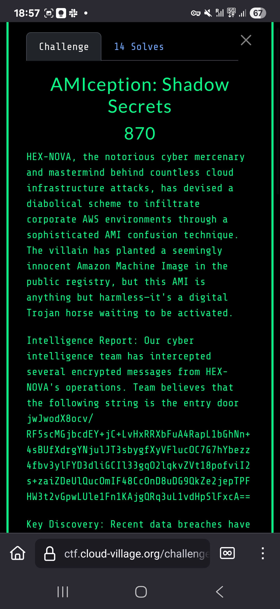
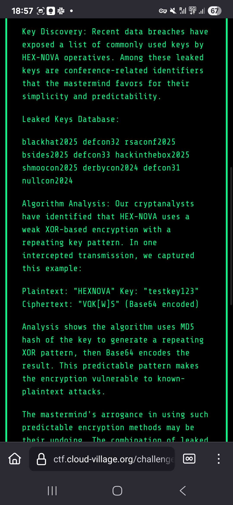
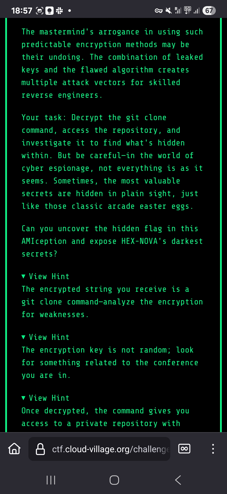
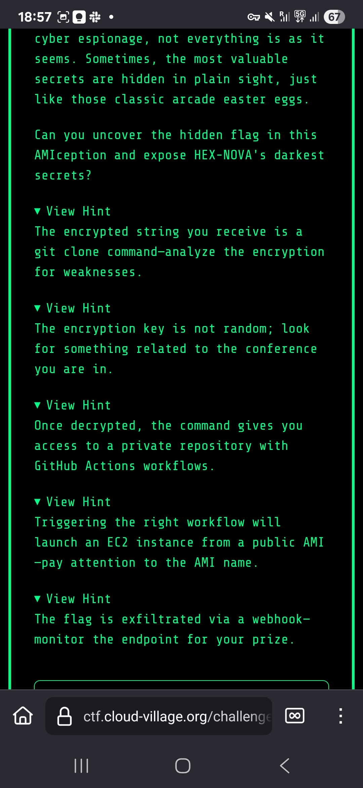

# AMIception: Shadow Secrets - Cloud Village CTF 2025

## Challenge Screenshots

## Challenge Overview

AMIception was a complex AWS-focused challenge that required us to navigate through multiple layers of AWS infrastructure, GitHub repositories, and AMI (Amazon Machine Image) configurations to uncover hidden secrets.

## Solution Steps

### Step 1: XOR Decryption
The challenge began with encrypted data that needed to be XOR decrypted using the key "defcon33". This decryption revealed GitHub Personal Access Token (PAT) credentials and access to a private repository.

### Step 2: Repository Analysis
With the GitHub credentials, we gained access to the `cloud-village/AMIception_Tests` repository. Analysis of this private repo revealed:
- Malicious AMI configurations
- Suspicious workflow files
- References to specific AWS regions and AMI IDs

### Step 3: AWS Reconnaissance
We performed reconnaissance in the `us-west-1` region and discovered multiple AMIs with the pattern `DEFCON33Ubuntuimage`. This pattern suggested these were purpose-built AMIs for the CTF challenge.

### Step 4: AMI Analysis
The breakthrough came when examining AMI descriptions. While most AMIs had generic descriptions like "None", one particular AMI stood out:

**AMI ID:** `ami-02e01e39fb136ec01`
**Description:** "AMIception with correct webhook modification"

This special description indicated this AMI contained the modified webhook script we needed.

### Step 5: Workflow Exploitation
We triggered a GitHub workflow that would launch an EC2 instance using the special AMI. This workflow was designed to:
- Launch the AMI in AWS
- Execute scripts with access to secrets
- Provide a pathway to the flag

### Step 6: Direct AMI Access
Instead of relying solely on the workflow, we launched the special AMI directly in our own AWS environment. This gave us direct access to the modified webhook script and allowed us to capture the flag without relying on external workflow execution.

#TODO: Add screenshot of the AMI discovery process showing the different descriptions

## Flag
`FLAG-{p9x2Z1tXlQ4JH6YvAsnB0Qur8CVodFSr}`

## Key Techniques
- XOR decryption with known key
- GitHub PAT exploitation
- Private repository analysis  
- AWS AMI reconnaissance
- Description-based AMI identification
- Direct cloud resource access

## Lessons Learned
This challenge showcased the interconnection between development platforms (GitHub) and cloud infrastructure (AWS), demonstrating how secrets can traverse multiple services and how careful analysis of metadata (like AMI descriptions) can reveal critical information for exploitation.