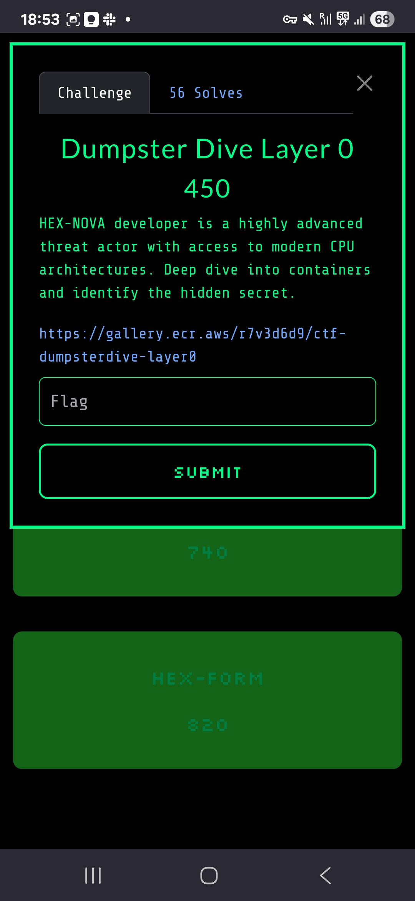

# DumpsterDive Layer 0 - Cloud Village CTF 2025

## Challenge Description

## Challenge Overview

DumpsterDive Layer 0 was a container forensics challenge that required analyzing Docker image layers to discover hidden flags embedded within the container filesystem.

**Challenge Number:** 790

## Container Analysis Approach

The challenge involved examining a Docker container image using specialized tools to inspect individual layers and identify where sensitive information might be stored.

## Solution

### Tool Selection: Dive
We used `dive`, a powerful tool for analyzing Docker image layers, to examine the container structure. Dive provides a detailed breakdown of each layer's contents and changes, making it perfect for forensic analysis.

### Layer Analysis Process
1. **Image Inspection:** Used dive to examine the overall image structure
2. **Layer Enumeration:** Identified all layers within the image
3. **Change Analysis:** Examined what files were added, modified, or deleted in each layer
4. **First Layer Focus:** Concentrated on the first layer where the flag was likely stored

### Flag Discovery
The analysis revealed that the flag was embedded in the first layer of the container image. We:
1. **Saved Layers Locally:** Extracted the image layers to the local filesystem
2. **Layer Extraction:** Specifically extracted the layer containing the changes
3. **File Analysis:** Examined the extracted layer contents to locate the flag

### Flag Location
The flag was discovered within the filesystem changes of the first layer:

## Flag
`FLAG-{732C496A8CCe46B024FCc7CA1ADa14Cb}`

## Key Techniques
- Docker image layer analysis
- Container forensics
- Layer extraction and examination
- File system change tracking

## Tools Used
- **dive:** Container image analysis tool
- Standard Linux file manipulation tools
- Docker layer extraction utilities

## Technical Insights

This challenge demonstrated several important concepts:
- **Layer-based Storage:** Docker images store changes in layers, and each layer can contain sensitive information
- **Forensic Analysis:** Even if containers are running, their build-time artifacts remain accessible in the image layers
- **Security Implications:** Developers may accidentally embed sensitive data during the build process

## Lessons Learned
- **Build Security:** Always review Docker image layers for sensitive information before deployment
- **Image Scanning:** Use tools like dive regularly to inspect image contents
- **Multi-layer Analysis:** Sensitive data can be hidden in any layer, not just the final one
- **Container Forensics:** Understanding layer structure is crucial for security analysis

The challenge showcased how container images can inadvertently store sensitive information in their layer history, emphasizing the need for proper image security practices.