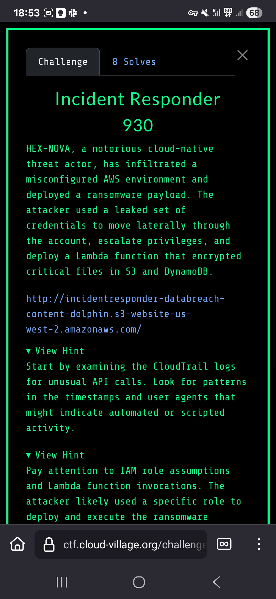

# Incident Responder (930 Points)

## Challenge Screenshots




## Challenge Overview
This incident response challenge involved analyzing CloudTrail logs and API Gateway endpoints to investigate a ransomware attack. We needed to trace the attack path through AWS services including DynamoDB and S3 to recover encrypted data and reconstruct the full flag.

## Solution Steps

### Initial Analysis
We started by examining the provided CloudTrail logs and identified suspicious activity involving a Lambda function and API Gateway endpoints. The logs revealed a ransomware encryption operation targeting specific AWS resources.

### Key Discovery - API Endpoint
From the CloudWatch logs, we discovered an API Gateway endpoint:
```
https://x7ia63zopb.execute-api.us-west-2.amazonaws.com
```

### DynamoDB Investigation
Our first attempt was to decrypt the DynamoDB table `HevNovaDataBreachDynamoDB-databreach`:
```bash
curl https://x7ia63zopb.execute-api.us-west-2.amazonaws.com//decrypt/dynamodb/HevNovaDataBreachDynamoDB-databreach
```

This revealed that the encryption/decryption service was operational and had processed items in the DynamoDB table.

### S3 Data Recovery
The breakthrough came when we accessed the S3 bucket containing the encrypted data:
```bash
curl https://x7ia63zopb.execute-api.us-west-2.amazonaws.com/decrypt/s3/hexnovadatabreach-databreach-content-dolphin/ImportantInformation.txt
```

This returned the first part of the flag:
```json
{"status": "success", "message": "Decryption successful.", "content": "PART1FLAG{R35p0nd_N0w}\n"}
```

### DynamoDB Flag Recovery
Through further investigation of the DynamoDB table structure, we discovered the second part of the flag stored as:
```
{"S": "PART2FLAG{_D1sc0v3r_F0r3ns1cs}"}
```

### Flag Reconstruction
Combining both parts revealed the complete flag:
```
FLAG-{R35p0nd_N0w_D1sc0v3r_F0r3ns1cs}
```

## Key Techniques
- CloudTrail log analysis for incident investigation
- API Gateway endpoint enumeration and exploitation
- DynamoDB table scanning and data recovery
- S3 object decryption through compromised services
- Multi-source flag reconstruction

## Tools Used
- `curl` for API endpoint interaction
- `grep` and text processing tools for log analysis
- JSON parsing for data extraction

#TODO: Add CloudTrail log analysis screenshots
#TODO: Include detailed API response examples
#TODO: Add timeline of the ransomware attack sequence

## Lessons Learned
This challenge demonstrated the importance of proper incident response procedures, including:
- Thorough log analysis across multiple AWS services
- Understanding ransomware attack patterns in cloud environments
- Leveraging misconfigured decryption services during incident response
- Reconstructing attack timelines from CloudTrail evidence

The scenario highlighted how attackers can abuse legitimate AWS services and the critical role of forensic analysis in cloud incident response.