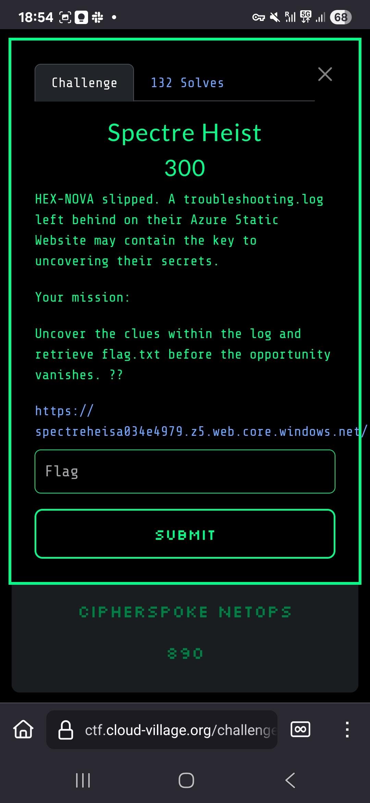

# Spectre Heist - Cloud Village CTF 2025

## Challenge Screenshots

## Challenge Overview

Spectre Heist was a 300-point Azure cloud security challenge that involved discovering and exploiting exposed log files containing sensitive Shared Access Signature (SAS) URLs to access restricted Azure Blob Storage.

## Solution

### Step 1: Initial Reconnaissance

The challenge started with a web application that hinted at troubleshooting logs being available. The key was identifying that there was a file called `troubleshooting.log` accessible on the server.

### Step 2: Log File Discovery

By accessing the troubleshooting log file, we found it contained various system information and debugging data. The critical discovery was identifying a Shared Access Signature (SAS) URL embedded within the log contents.

### Step 3: SAS URL Analysis

The troubleshooting log revealed an Azure Blob Storage SAS URL. SAS URLs provide time-limited access to Azure storage resources without requiring authentication credentials, making them a common target for information disclosure vulnerabilities.

### Step 4: Direct Access

With the SAS URL extracted from the log file, direct access to the Azure Blob Storage resource was possible. Visiting the URL directly provided access to the restricted content containing the flag.

## Flag

The flag was retrieved by accessing the SAS URL found in the troubleshooting log.

## Key Techniques

- **Log File Enumeration:** Discovering exposed troubleshooting logs
- **Azure SAS URL Exploitation:** Understanding and exploiting Shared Access Signatures
- **Information Disclosure:** Extracting sensitive URLs from system logs
- **Direct Cloud Storage Access:** Bypassing application-level restrictions

## Security Implications

This challenge highlighted several critical security issues:

### SAS URL Management
- **Time-limited Access:** SAS URLs should have appropriate expiration times
- **Scope Limitation:** SAS tokens should be limited to necessary permissions only
- **Secure Distribution:** SAS URLs should never be logged in plain text

### Log Security
- **Sensitive Data in Logs:** System logs should be sanitized to prevent credential exposure
- **Log Access Controls:** Troubleshooting logs should not be publicly accessible
- **Log Monitoring:** Regular review of log contents for sensitive information

### Azure Security Best Practices
- **Principle of Least Privilege:** SAS tokens should grant minimal required access
- **Monitoring:** Azure storage access should be monitored for unusual patterns
- **Rotation:** Regular rotation of access signatures and storage keys

## Lessons Learned

1. **Never log sensitive URLs:** SAS URLs and other sensitive access tokens should never appear in system logs
2. **Secure log access:** Troubleshooting and debug logs should be protected with proper access controls
3. **SAS token hygiene:** Implement proper lifecycle management for Shared Access Signatures
4. **Regular security reviews:** Periodically audit logs and accessible files for information disclosure

The Spectre Heist challenge demonstrated how seemingly innocuous system logs can become a significant security vulnerability when they contain sensitive cloud storage access URLs, emphasizing the need for proper log sanitization and access control in cloud environments.