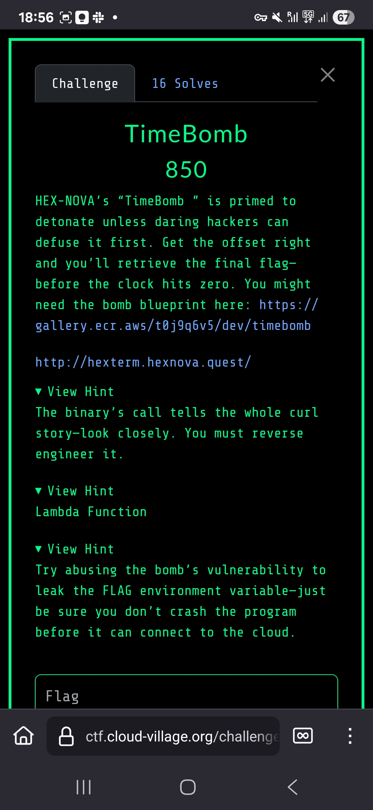

# TimeBomb (850 Points)

## Challenge Description



## Challenge Overview
TimeBomb was a binary exploitation challenge featuring a C program with a classic format string vulnerability. The challenge was accessible via `nc timebomb-dc33.hexnova.quest 9999` and required exploiting the vulnerability to extract a flag stored as an environment variable.

## Solution Steps

### Initial Analysis
We started by examining the vulnerable C code, which contained a critical format string bug in the `vuln()` function:

```c
void vuln() {
    char buffer[512];
    fgets(buffer, sizeof(buffer), stdin);
    printf(buffer);  // FORMAT STRING VULNERABILITY!
    exit(0);
}
```

The `printf(buffer)` call directly prints user input without a format specifier, creating a textbook format string vulnerability.

### Vulnerability Confirmation
Our first step was confirming the format string bug with a simple payload:
```
%x.%x.%x.%x.%x.%x.%x.%x
```

This revealed stack contents in hexadecimal format, confirming the vulnerability was exploitable and showing us the stack layout.

### Finding Input Position
To locate our input on the stack, we used:
```
AAAA%x.%x.%x.%x.%x.%x.%x.%x.%x.%x.%x.%x
```

We found our input (AAAA = 0x41414141) at stack position 6, which meant we could use `%6$n` for arbitrary writes if needed.

### Stack Reconnaissance 
We systematically mapped the stack using payloads like:
- `%40$p.%41$p...%50$p` 
- `%85$p.%90$p...%120$p`

This revealed promising high memory addresses around positions 105-120 that could point to environment variables.

### Environment Variable Extraction
The key insight was that the flag was stored as an environment variable, not requiring code execution. We used direct parameter access to read strings from specific stack positions:

- `%105$s` → `AWS_EXECUTION_ENV=AWS_ECS_FARGATE`
- `%110$s` → `LAMBDA_URL=https://yavdhl4qozqpiugwirgyfhj4hm0hpykh.lambda-url.us-west-1.on.aws/`
- `%115$s` → `FLAG=FLAG-{Reverse7heBombt0trigg3rflagc4fb5}` ✅

### Flag Recovery
The successful payload `%115$s` revealed the complete flag:
```
FLAG-{Reverse7heBombt0trigg3rflagc4fb5}
```

## Key Techniques
- Format string vulnerability exploitation
- Stack layout analysis and reconnaissance  
- Direct parameter access using `%N$s` syntax
- Environment variable extraction from memory
- Binary exploitation without code execution

## Tools Used
- `nc` for network connection
- Format string payloads for memory reading
- Systematic stack position enumeration
- Manual exploitation techniques

## Lessons Learned
This challenge demonstrated several important concepts:
- Format string vulnerabilities remain dangerous and common
- Environment variables are stored at predictable stack locations
- Sometimes information disclosure is sufficient without achieving code execution
- Systematic approach to stack reconnaissance is crucial for exploitation
- The `%N$s` syntax provides powerful direct memory access capabilities

The solution highlighted how format string bugs can be leveraged for information disclosure, showing that not all binary exploitation requires achieving code execution - sometimes reading sensitive data from memory is the intended path.