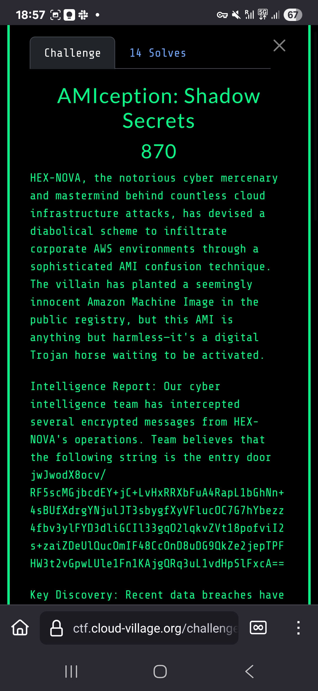
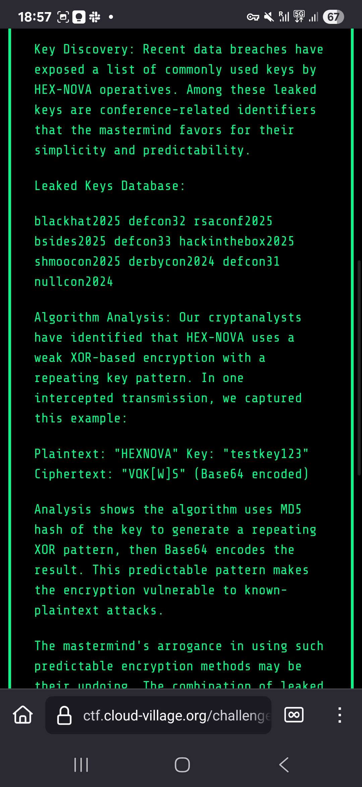
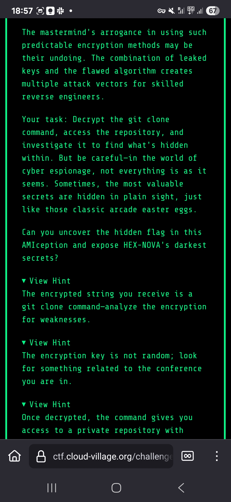
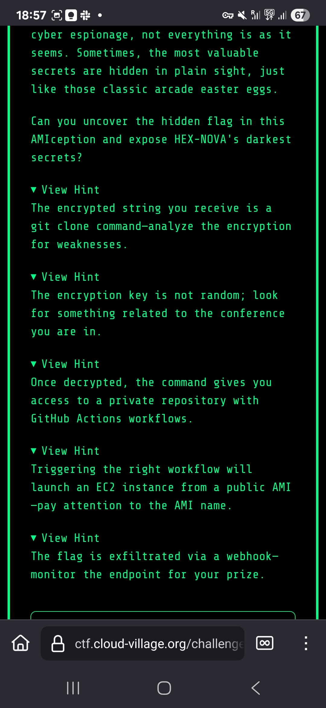

# AMIception: Shadow Secrets - Cloud Village CTF 2025

## Challenge Description






## Initial Discovery

The challenge started with encrypted data that needed to be XOR decrypted using the key `"defcon33"`. This revealed:
- GitHub Personal Access Token (PAT) credentials
- Access to a private repository

Using the GitHub PAT, we accessed the private repository `cloud-village/AMIception_Tests`. Analysis revealed:
- Malicious AMI configurations
- GitHub workflow files
- References to AWS regions and specific AMI IDs

## AWS AMI Reconnaissance

We performed reconnaissance in the `us-west-1` region searching for AMIs:

```bash
aws ec2 describe-images --region us-west-1 --filters "Name=name,Values=*DEFCON33*"
```

Multiple `DEFCON33Ubuntuimage` AMIs were discovered.

## The Key Discovery

The breakthrough came when examining AMI descriptions. Most had generic descriptions like "None", but one stood out:

**AMI ID:** `ami-02e01e39fb136ec01`  
**Description:** `"AMIception with correct webhook modification"`

This special description indicated this AMI contained the modified webhook script we needed.

## GitHub Workflow Exploitation

We triggered the GitHub workflow that would launch EC2 instances using the special AMI. The workflow was designed to execute scripts with access to secrets.

## Direct AMI Access

Instead of relying solely on the workflow, we launched the special AMI directly in our own AWS environment:

```bash
aws ec2 run-instances --image-id ami-02e01e39fb136ec01 --region us-west-1
```

This gave us direct access to the modified webhook script and allowed us to capture the flag.

Boom! 💥

## Flag
`FLAG-{p9x2Z1tXlQ4JH6YvAsnB0Qur8CVodFSr}`