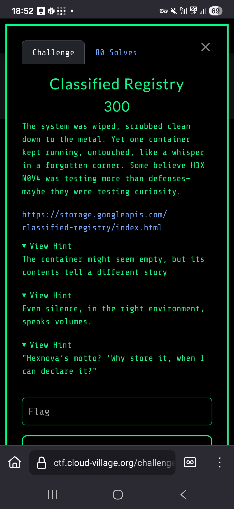
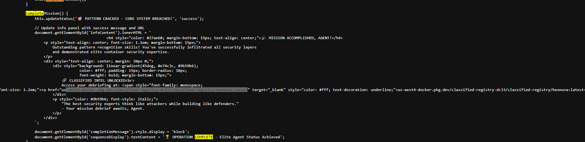

# Classified Registry - Cloud Village CTF 2025

## Challenge Description



## Initial Discovery

The challenge presented a website with a "lock picking pattern" that needed to be bypassed to access a container registry or containerized application.

The pattern could be completed manually, or alternatively, the URL of the container image could be found directly by inspecting the source code of the website.

Viewing the page source, there was a link to a Google Artifact Registry:
`us-west4-docker.pkg.dev/classified-registry-dc33/classified-registry/hexnova:latest`



The key to solving this challenge was understanding that the flag was stored as an environment variable within a Docker container.

## Container Environment Analysis

Once we had the container URL, we could run it and enumerate the environment variables:

```bash
docker run -ti us-west4-docker.pkg.dev/classified-registry-dc33/classified-registry/hexnova:latest sh
```


## Flag Discovery

The flag was stored in an environment variable named `MY_ENV_VAR`:

```bash
env | grep FLAG
MY_ENV_VAR=FLAG-{zDAkRWAi4znMkIhjaqZnU2T264XG2fPQ}
```

The challenge demonstrated how seemingly simple container misconfigurations can lead to complete exposure of sensitive information.