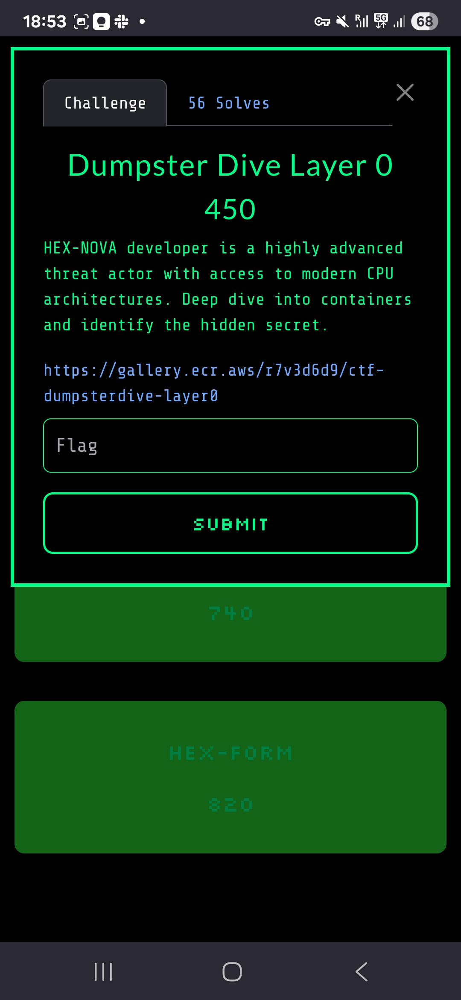
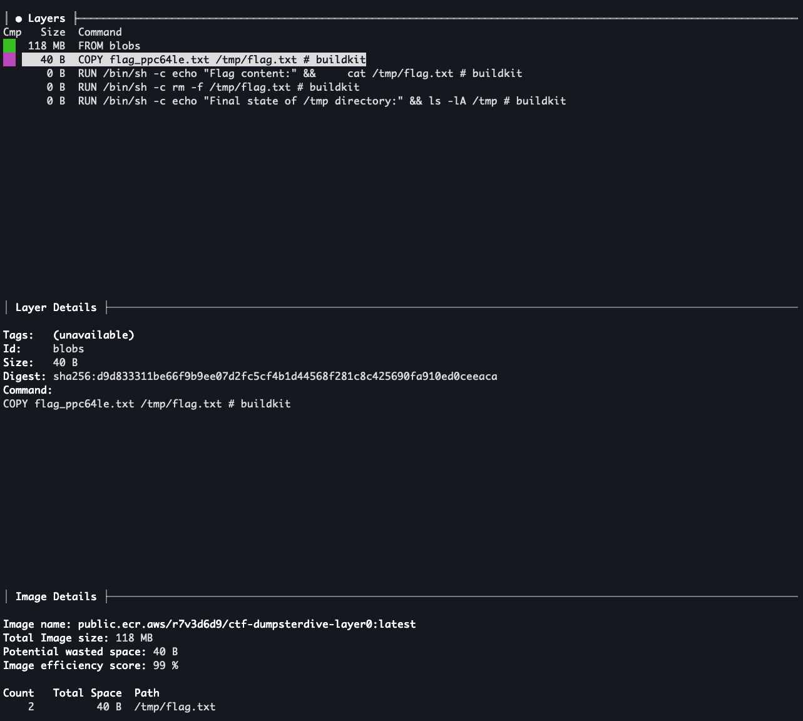

# Dumpster Dive Layer 0 - Cloud Village CTF 2025

## Challenge Description



## Initial Discovery

DumpsterDive Layer 0 was a container forensics challenge that required analyzing Docker image layers to discover hidden flags embedded within the container filesystem.

The challenge involved examining a Docker container image using specialized tools to inspect individual layers and identify where sensitive information might be stored.

## Tool Selection: Dive

We used `dive`, a powerful tool for analyzing Docker image layers, to examine the container structure. Dive provides a detailed breakdown of each layer's contents and changes, making it perfect for forensic analysis.

```bash
dive public.ecr.aws/r7v3d6d9/ctf-dumpsterdive-layer0:latest
```



## Layer Analysis Process
1. **Image Inspection:** Used dive to examine the overall image structure
2. **Layer Enumeration:** Identified all layers within the image
3. **Change Analysis:** Examined what files were added, modified, or deleted in each layer
4. **First Layer Focus:** Concentrated on the first layer where the flag was likely stored

## Flag Discovery
The analysis revealed that the flag was embedded in the first layer of the container image. We:

1. **Saved Layers Locally:** Extracted the image layers to the local filesystem using docker save:
```bash
docker save public.ecr.aws/r7v3d6d9/ctf-dumpsterdive-layer0:latest -o ctf-image.tar
tar -xf ctf-image.tar
```

2. **Layer Extraction:** Specifically extracted the layer containing the changes:
```bash
gunzip -c d0e8ddb8e90d2d9689bfe4ea4a2a88acebd6d25dcec69264b38b39deedda8c91 | tar -xvf -
x tmp/
x tmp/flag.txt
```

3. **File Analysis:** Examined the extracted layer contents to locate the flag:
```bash
cat tmp/flag.txt
FLAG-{732C496A8CCe46B024FCc7CA1ADa14Cb}
```

## Flag Location
The flag was discovered within the filesystem changes of the first layer in the file `tmp/flag.txt`.

## Flag
`FLAG-{732C496A8CCe46B024FCc7CA1ADa14Cb}`

The challenge showcased how container images can inadvertently store sensitive information in their layer history, emphasizing the need for proper image security practices.