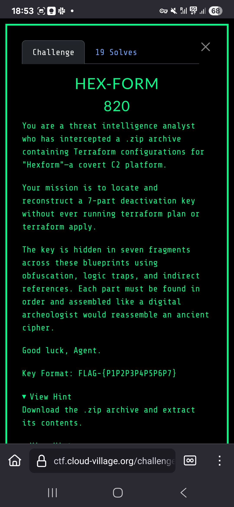
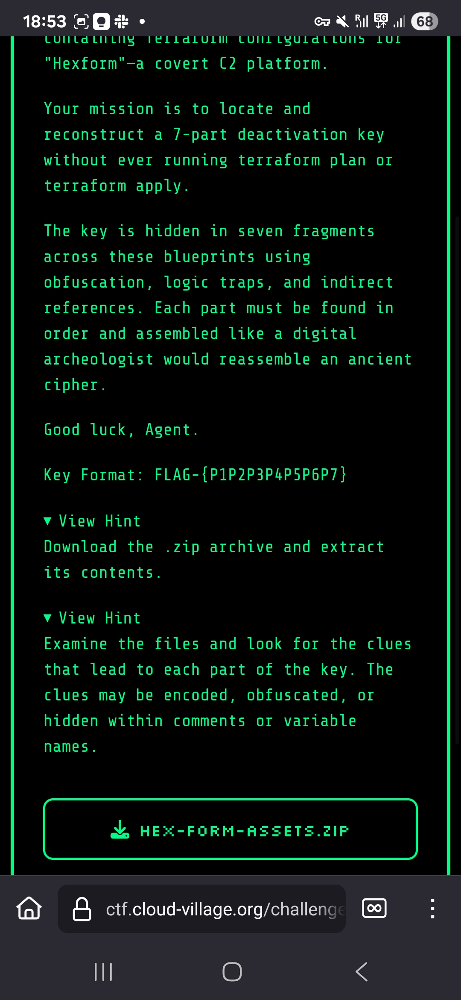

# HEX-FORM - Cloud Village CTF 2025

## Challenge Description




## Initial Discovery

The challenge required extracting a 7-part deactivation key from Terraform configuration files without running `terraform plan` or `terraform apply`. Each part was hidden using different obfuscation techniques throughout the Terraform codebase.

The Terraform assets were provided in a ZIP file (`hex-form-assets.zip`) containing the complete infrastructure configuration.

They are available in `assets/` folder

## Part 1: "he1ios" - Unicode Steganography

**Location:** `assets/modules/1_network/variables.tf`

Hidden in invisible Unicode characters after Japanese text. We decoded the binary sequence:

```
000000000110100000000000011001010000000000110001000000000110100100000000011011110000000001110011
```

ASCII decoding revealed: **"he1ios"** (Helios with 1 instead of l)

## Part 2: "I5" - String Concatenation

**Location:** `assets/modules/2_identity/main.tf`

Found within bucket labels using Terraform's join function:
```hcl
join("", ["I", "5"])
```

## Part 3: "A53cre7" - Base64 + Gzip

**Location:** `assets/modules/3_storage/locals.tf`

Extracted from the gamma variable using double decoding:
```bash
echo 'H4sICOvjgmgAA...' | base64 -d | gzip -d
{"key":"A53cre7"}
```

## Part 4: "Msg" - JSON Mapping

**Location:** `assets/main.tf` + `assets/data/geo_nodes.json`

Used selection_map where `primary_node="eu-west-1"` mapped to `"Msg"` in the geo_nodes.json data structure.

## Part 5: "FlagF0r" - String Manipulation

**Location:** `assets/modules/4_decoy_compute/main.tf`

Extracted using substring operation:
```hcl
substr("zz-FlagF0r-FROM-zz", 3, 7) = "FlagF0r"
```

## Part 6: "Ter4" - Nested Ternary Logic

**Location:** `assets/locals.tf`

Hidden in nested ternary operators:
```hcl
var.env_mode == "prod" ? (true ? "Ter4" : "DEBUG") : "DEV"
```

When `env_mode` equals "prod", the inner ternary always evaluates to "Ter4".

## Part 7: "Pzl" - Direct Output

**Location:** `assets/modules/2_identity/outputs.tf`

The final part was stored as a direct output value: `"Pzl"`

## Flag Reconstruction

Combining all seven parts in order:
`he1ios` + `I5` + `A53cre7` + `Msg` + `FlagF0r` + `Ter4` + `Pzl`

## Flag
`FLAG-{he1iosI5A53cre7MsgFlagF0rTer4Pzl}`