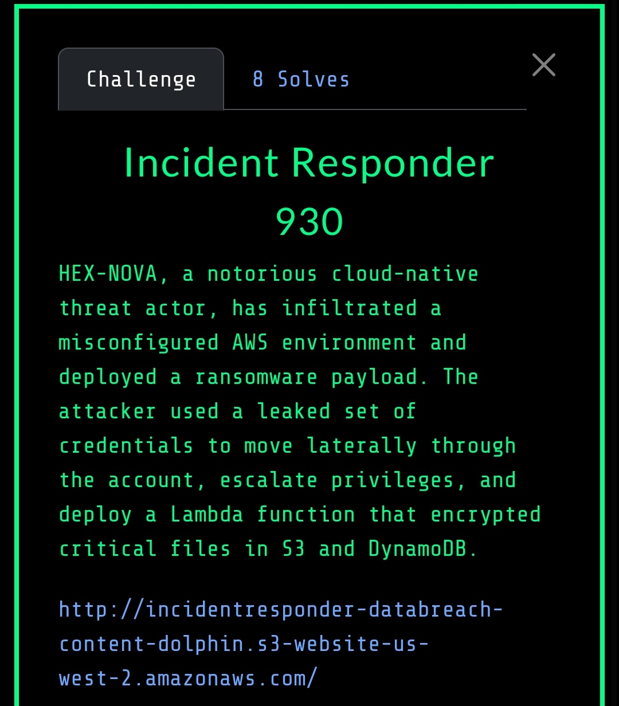

# Incident Responder (930 Points)

## Challenge Description




## Initial Analysis
We started by examining the provided CloudTrail logs and identified suspicious activity involving a Lambda function and API Gateway endpoints. The logs revealed a ransomware encryption operation targeting specific AWS resources.

From the CloudWatch logs, we discovered an API Gateway endpoint:
```
https://x7ia63zopb.execute-api.us-west-2.amazonaws.com
```

After doing a ton of grepping I found an interesting API Gateway endpoint:
```
curl https://x7ia63zopb.execute-api.us-west-2.amazonaws.com/decrypt/s3/

{"message": "Missing path parameters. Expected /encrypt|decrypt/{resourceType}/{name}/{identifier} or /encrypt/{resourceType}/{name}", "example_s3_encrypt": "/encrypt/s3/your-bucket-name/path/to/object.txt", "example_s3_decrypt": "/decrypt/s3/your-bucket-name/path/to/object.txt", "example_dynamodb_single": "/encrypt/dynamodb/YourTableName/item-id", "example_dynamodb_all": "/encrypt/dynamodb/YourTableName", "example_dynamodb_decrypt": "/decrypt/dynamodb/YourTableName"}%
```

Doing another ton of grepping I made a list of suspicious s3 and dynamodb resources:
```
/s3/hexnovadatabreach-databreach-content-dolphin/ImportantInformation.tx
/s3/hexnovadatabreach-databreach-content-dolphin/ImportantInformation.txt
/s3/hexnovadatabreach-databreach-content-dolphin/NoteTaking.txt
CloudWatch.json:            "message": "Processing single item with identifier: ImportantItem\n",
CloudWatch.json:            "message": "Encrypted DynamoDB item with PK 'ImportantItem' in table 'HevNovaDataBreachDynamoDB-databreach
CloudWatch.json:            "message": "Deleted DynamoDB item with PK 'ImportantItem' from table 'HevNovaDataBreachDynamoDB-databreach
```


First we accessed the data from s3:
```bash
curl https://x7ia63zopb.execute-api.us-west-2.amazonaws.com/decrypt/s3/hexnovadatabreach-databreach-content-dolphin/ImportantInformation.txt

{"status": "success", "message": "Decryption successful.", "content": "PART1FLAG{R35p0nd_N0w}\n"}
```

This returned the first part of the flag.

Then we accessed the data from dynamodb:
```bash
curl https://x7ia63zopb.execute-api.us-west-2.amazonaws.com//decrypt/dynamodb/HevNovaDataBreachDynamoDB-databreach > HevNovaDataBreachDynamoDB-databreach.json
# Output first to file because it was too long (that's what she said)

grep -A3 -B3 FLAG HevNovaDataBreachDynamoDB-databreach.json
    },
    {
      "DefCon33PartitionKeyDynamoDB": {
        "S": "PART2FLAG{_D1sc0v3r_F0r3ns1cs}"
      }
    },
```

### Flag Reconstruction
Combining both parts revealed the complete flag:
```
FLAG-{R35p0nd_N0w_D1sc0v3r_F0r3ns1cs}
```
