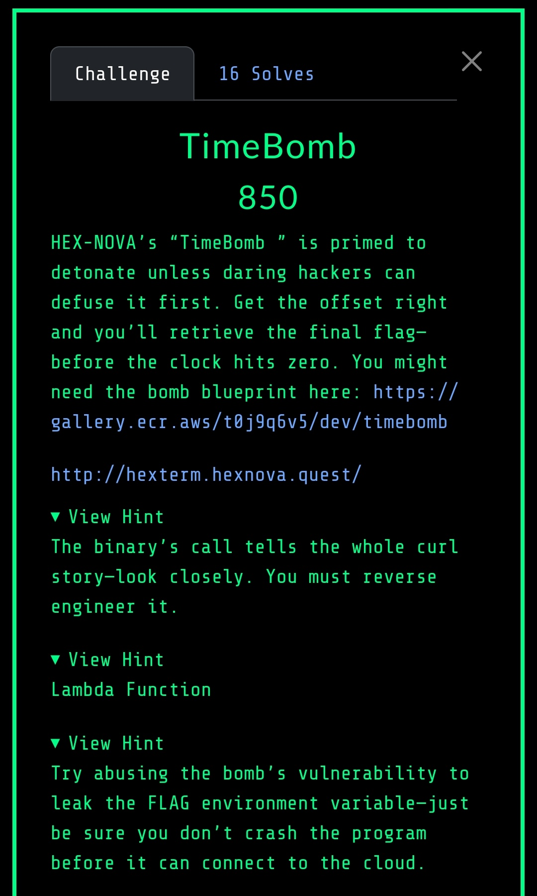

# TimeBomb (850 Points)

## Challenge Description



## Initial Analysis

Inside the docker container we found the code from the challenge:
```c
root@aee3f9711c91:/home/ctf# cat challenge.c
#include <stdlib.h>
#include <stdio.h>
#include <string.h>
#include <unistd.h>
#include <time.h>
#include <signal.h>

void connection() {
    char *lambda_url = getenv("LAMBDA_URL");
    char *token = getenv("SECRET_TOKEN");

    if (!lambda_url || !token) {
        fprintf(stderr, "[!] Missing environment variables.\n");
        exit(1);
    }

    printf("[*] Executing Lambda...\n");

    char cmd[512];
    snprintf(cmd, sizeof(cmd),
             "curl -s -X POST %s -H 'Content-Type: application/json' -d '{\"token\":\"%s\"}'",
             lambda_url, token);

    system(cmd);
    fflush(stdout);
    exit(0);
}


void timebomb() {
    puts("[----------------------------------------]");
    puts("[  TIMEBOMB TERMINAL: MISSION INTERFACE  ]");
    puts("[----------------------------------------]");
    puts("> DEVICE ARMED: DESTRUCT SEQUENCE INITIATED");
    sleep(1);
    puts("> SECURITY BREACH DETECTED — TRACE PROTOCOL ENGAGED");
    for (int i = 5; i > 0; --i) {
        printf("> SYSTEM WIPE IN: T-minus %d seconds...\n", i);
    fflush(stdout);
    sleep(1);
}
}


void vuln() {
    char buffer[512];
    puts("[-----------------------------------------]");
    puts("[  TIMEBOMB TERMINAL: TERMINAL INTERFACE  ]");
    puts("[-----------------------------------------]");
    puts(" [CLASSIFIED] Authorization required...");
    printf("Enter your OVERRIDE CODE: ");
    fflush(stdout);
    fgets(buffer, sizeof(buffer), stdin);
    printf(buffer);
    printf("\n[-] Done.\n");
    fflush(stdout);
    fflush(stdout);
    exit(0);
}


int main() {
    timebomb();
    vuln();

    return 0;
}
```

We (meaning me and an LLM) started by examining the C code, which contained a critical format string bug in the `vuln()` function:

```c
void vuln() {
    char buffer[512];
    fgets(buffer, sizeof(buffer), stdin);
    printf(buffer);  // FORMAT STRING VULNERABILITY!
    exit(0);
}
```

The `printf(buffer)` call directly prints user input without a format specifier, creating a textbook format string vulnerability.

## Vulnerability Confirmation
Our first step was confirming the format string bug with a simple payload:
```
%x.%x.%x.%x.%x.%x.%x.%x
```

This revealed stack contents in hexadecimal format, confirming the vulnerability was exploitable and showing us the stack layout.

To locate our input on the stack, we used:
```
AAAA%x.%x.%x.%x.%x.%x.%x.%x.%x.%x.%x.%x
```

We found our input (AAAA = 0x41414141) at stack position 6, which meant we could use `%6$n` for arbitrary writes if needed.

We systematically mapped the stack using payloads like:
- `%40$p.%41$p...%50$p`
- `%85$p.%90$p...%120$p`

This revealed promising high memory addresses around positions 105-120 that could point to environment variables.

## Environment Variable Extraction
The key insight was that the flag was stored as an environment variable, not requiring code execution. We used direct parameter access to read strings from specific stack positions:

- `%105$s` → `AWS_EXECUTION_ENV=AWS_ECS_FARGATE`
- `%110$s` → `LAMBDA_URL=https://yavdhl4qozqpiugwirgyfhj4hm0hpykh.lambda-url.us-west-1.on.aws/`
- `%115$s` → `FLAG=FLAG-{Reverse7heBombt0trigg3rflagc4fb5}` ✅

It was crazy how easy was for the LLM to find and exploit the vulnerability... I mean me!